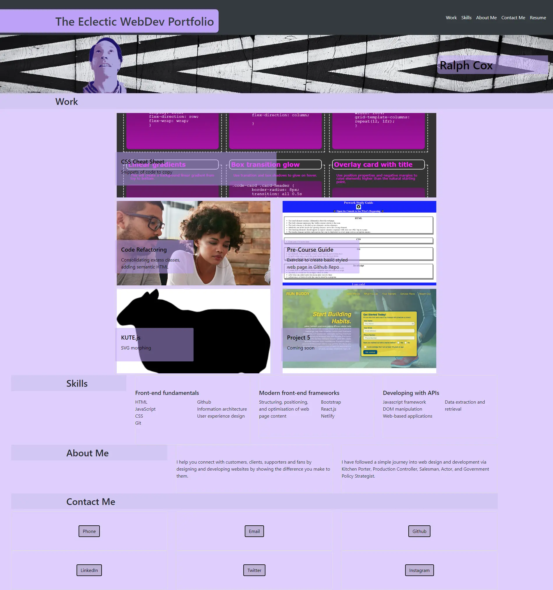

# Bootstrap-Portfolio
Bootcamp Challenge 3 demonstrating Bootstrap Framework
Initial Portfolio Project to be updated during course

## Description

- This project will be the showcase for my work during the course and beyond.
- I built this project to develop bootstrap skills.
- This project helped me learn how customise bootstrap techniques.
- I learned the importance of adding rows and columns for layout control of card components.

### Grid Flex Positioning: placing elements and ensuring flexibility for responsive design.

### User Story

```
AS A marketing agency
I WANT a codebase that follows accessibility standards
SO THAT our own site is optimized for search engines
```

### Acceptance Criteria

* When the page is loaded the page presents my name, a recent photo or avatar, and links to sections about me, my work, and how to contact me
* When one of the links in the navigation is clicked then the UI scrolls to the corresponding section
* When viewing the section about my work then the section contains titled images of my applications
* When presented with my first application then that application's image should be larger in size than the others
* When images of the applications are clicked then the user is taken to that deployed application
* When the page is resized or viewed on various screens and devices then the layout is responsive and adapts to my viewport.
*The website should include the following bootstrap components:
  * A Navigation bar
     * A navigation menu at the top. Feel free to use bootstrap's navbar or create your own.
     * Links should navigate to the appropriate sections
  * A hero section
      * A jumbotron featuring your picture, your name, and any other information you'd like to include.
  * A work section
      * A section displaying your work in grid.
      * Use bootstrap cards for each project.
      *The description should give a brief overview of the work.
      * Each project will eventually link to your class project work!
  * A skills section
      * List out the skills you expect to learn from the bootcamp.
  * An about / contact section.
    * An "About Me" section in the same row.
  * A footer section.
  * All hyperlinks should have a hover effect.
  * All buttons should display a box shadow upon hover.

* The resulting page should match the following image:



## Installation

This is a basic static front-end website deployment which can be deployed on any server or client with a browser. [The GIThub page deployment](https://essexgit.github.io/WebPortfolio/)

## Credits

All placeholder  images provided by EdX

## Licence
This work is published under the [MIT Licence](./LICENSE)